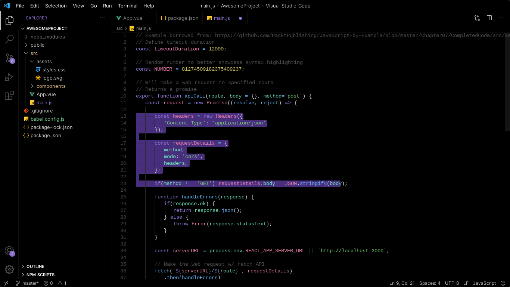
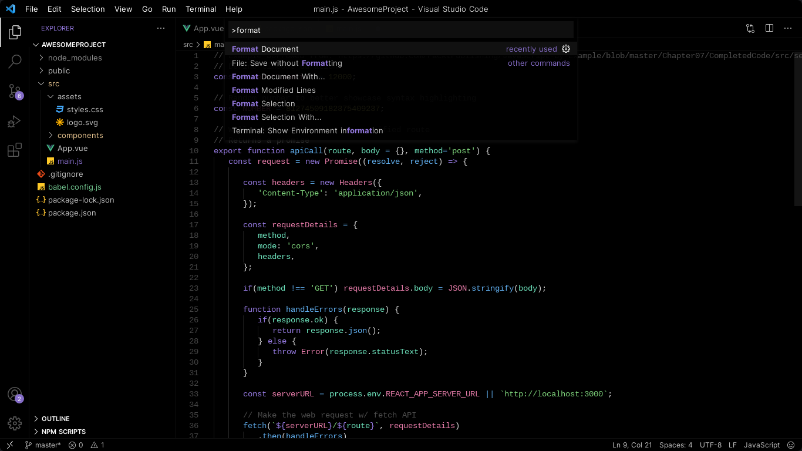
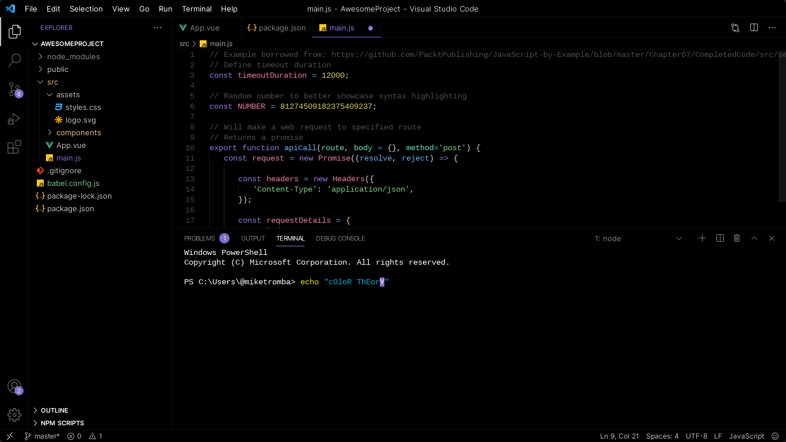

# Purple Void for Visual Studio Code

Black theme with purple accents.

## Installation
[](https://marketplace.visualstudio.com/items?itemName=Rej.purpleVoid)

or

[](https://open-vsx.org/extension/Rej/purpleVoid)

## Manual Installation
### Step 1.
Clone or download this repository.
### Step 2.
In the root folder `(...\purpleVoid-main)` of this repository run this command on your terminal.
```
vsce package
```
*vsce, short for "[Visual Studio Code Extensions](https://code.visualstudio.com/api/working-with-extensions/publishing-extension#installation)", is a command-line tool for packaging, publishing and managing VS Code extensions.*

### Step 3.
Install the new VSIX file through Virtual Studio Code extensions. `(extensions>views and more actions...>install from vsix...)`

## Preview






## License

[](https://github.com/Rejdesu/void/blob/main/LICENSE)
